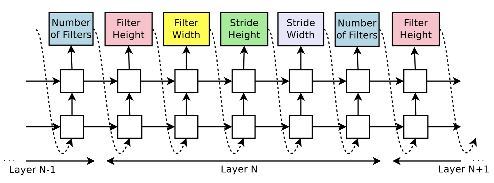
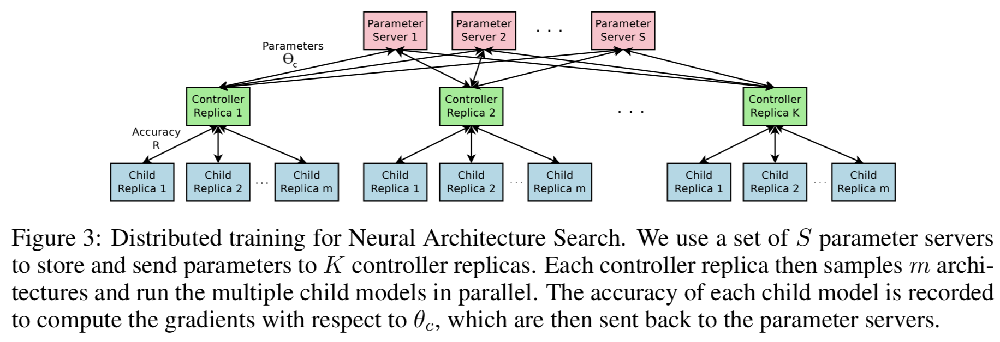
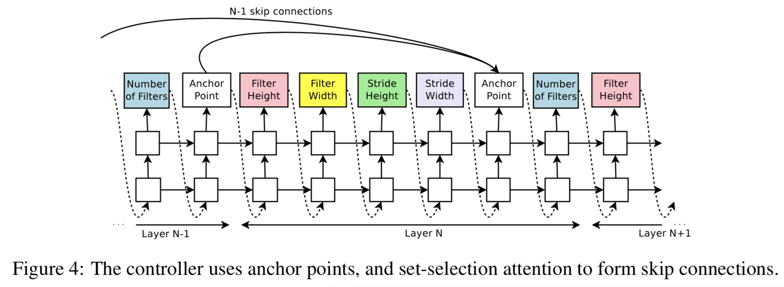

# Note: 170604
## AutoML - Meeting
- 

## Paper review - [ICLR '17, Google Brain (Google ML Cloud AutoML Technology)] [[Paper]](https://arxiv.org/pdf/1611.01578.pdf) [[OpenReview]](https://openreview.net/forum?id=r1Ue8Hcxg)
- Introduction
 	- Deep Neural Network가 획기적인 성능을 발휘하고, 실용적으로도 그 가치를 선보이고 있다. 
 	- DNN의 발전은 '어떻게 Feature를 디자인 할 것인가'에서 '어떻게 network 구조를 디자인 할 것인가'로의 paradigm shift를 겪고 있다. 이는 SHFT-HOG-AlexNet-VGGNet-GooGLeNet-ResNet-DenseNet으로 변화하면서 성능이 급격히 향상되는 것으로 몸소 체험 할 수 있을 것이다.
 	- 여러 Deep learning framework이 발전함에 따라, 실제 구현하는 어려움은 급격히 낮아졌음에도, '적절한' architecture를 설계하는 것은 아직까지 expert knowledge를 요하고 있고, 많은 시간을 소모하는 시행착오를 요구한다.

 본 논문에서는 **Neural Architecture Search**의 방법론을 제안한다.
 	- Gradient-based method로, _좋은 network 구조를 탐색하는_ 것에 그 목적을 둔다.
 	- Research Motivation은 _Neural network의 structure와 connectivity를 variable length String_ 으로 표현 가능하다는 것에서 부터 시작하였다.
 	- (예를 들어, 1개의 Conv layer를 정의하고자 할 때, filterHeight 5, filterWidth 3, strideHeight 2, strideWidth 2, numOfFilter 10 이라 하면 해당 Conv Layer에 필요한 모든 layer를 정의 한 것이며, 순서가 정해져 있다고 가정한다면 {5;3;2;2;10} 으로 정의가 가능하다.)
 	- 그러면, 5개의 integer로 구성된 String 532210 (각 숫자는 char이라 하자. 그럼 10도 문제 없을 거다.)을 순차적으로 출력하는 recurrent network를 학습시켜 optimize 할 수 있다면?
 	- 그리고, 학습에 필요한 target value는 해당 network의 precision (acc. rate)이라 가정하고, gradient-ascent를 사용하여 학습 시킬 수 있다면?

 	- 이것이 본 **Neural Architecture Search**에서 제안하는 기본적인 방법이며, 학습되는 network이자 target network의 구조를 출력하는 해당 recurrent network을 _Controller RNN_ 이라 칭하기로 한다.
 	- CIFAR-10을 from scratch로 학습시켰을 때, 0.0365의 test set error를 내고, SOTA algorithm 보다 1.05배나 더 빠른 "새로운" CNN 구조를 만들 수 있었다.

- Related Works
 	- 뭐 이건 필요하면 나중에 추가로 더 보겠음.
 	- 일반적인 Hyperparameter optimization 방법론들은 **제한된 network structure**에서 variation을 가지는 형태로만 explore 하는 것이 한계였다면, Modern neuro-evolution algorithm으로 제시된 algorithm들은 좀 더 novel한 구조를 제시 할 수 있었으나 large-structure에서 제한점을 보였고, search-based methods의 한계인 속도 문제를 향상시키기 위해 많은 huristics를 사용해야하는 한계를 가졌음
 	- 최근 많이 언급되는 meta learning에 대한 언급도 있으나, _우리 알고리즘보다 novel함은 덜 한데?_ 라는 말로 넘어감.

- Method
 	- Simple method of using a recurrent network to generate convolutional architectures.

 	- RNN controller를 사용하며, CNN layer의 hyperparameter를 a sequence of tokens로 출력하는 형태이다.
 	- 각 Layer depth에 필요한 hyperparameter를 token으로 출력하며, 출력된 token은 그 다음 hidden의 input으로 들어가게 된다.
 	- 지속적으로 쌓다가, layer depth가 일정 이상으로 증가하게 되면 stop하게 되며, token으로 주어진 hyperparameter를 가지는 Convolution Network구조를 생성, 학습시킨다.
 	- 학습시킨 후, validation data에 대한 accuracy를 reward로 갖게 되며, controller RNN의 parameter인 $\theta_c$에 대해 gradient-ascent를 이용하여 학습시킴.

 Training with REINFORCE
 	- Child Network (여기서는 CNN)의 hyperparameter로써 controller가 출력한 list of tokens는 list of actions $a_{1:T}$ 로 해석이 가능하다!
 	- 다만 여기서는 notation으로 T를 사용하는데, 이것이 일반적으로 강화학습에서 사용하는 time-domain action sequence인지, 기록의 편의를 위해 T를 사용한 것인지는 확인이 필요함
 	- 무튼, Child network의 validation dataset에 대한 accuracy를 Reward $R$로써 활용하고, optimal architecture를 찾기 위해서는

 	- Expected cummulative reward를 최대화하는 방향으로 학습!
 	- 개념적으로는 $J(\theta_c)=E_{P(a_{1:T});\theta_c}[R]$ 로 표현이 가능하지만, reward signal $R$은 non-differentiable!
 	- End-to-End concept으로 학습이 불가능하기 때문에, 강화학습 domain에서의 학습 방식을 가지고 오겠다! (Policy gradient method: 대표적으로 REINFORCE!)
 	- REINFORCE로 학습하기위해 다시 써 보면 $\nabla_{\theta_c} J(\theta_c)=\Sigma_{t=1}^{T} E_{P(a_{1:T};\theta_c)} [\nabla_{\theta_c} \log P(a_t|a_{(t-1):1};\theta_c)R]$ 로 표현되고
 	- Emphirical approximation하면 (for $m$ batch size) ${\frac{1}{m} \Sigma_{k=1}^m \Sigma_{t=1}^{T} \nabla_{\theta_c} \log P(a_t|a_{(t-1):1};\theta_c) R_k$ 로 표현이 가능하다.
 	- $m$은 controller가 1개의 batch에서 sampling 하는 different architecture의 개수, T는 hyperparameter 의 개수이다. (number of tokens)

 	- 근데 이 식 그대로 계산하면 variance가 너무 커서, baseline function b를 도입하여 variance를 좀 줄이고자 하였다.
 	- ${\frac{1}{m} \Sigma_{k=1}^m \Sigma_{t=1}^{T} \nabla_{\theta_c} \log P(a_t|a_{(t-1):1};\theta_c) (R_{k}-b)$ 
 	- 이렇게 식을 수정해도 unbiased gradient estimate라 문제없다. (고 한다)

 Accelerate Training with Parallelism and Asynchronous Updates
 	- 이런 개념으로 생각 해 보면, 매 번의 gradient update는 1 개의 child network에만 적용되는거고, 해당 child network 하나 학습시키는데만 해도 몇 시간이 걸린다! 이건 돼 봐야 쓸모가 없다!
 	- 그래서 분산 학습 및 비동기 파라미터 갱신 (distributed training and asynchronous parameter update)을 본 논문에서는 수행하였다.

 	- $S$ shard로 이루어진 parameter server가 존재하고, $K$ controller replica에 대한 shared parameter를 저장한다.
 	- 각각의 controller replica는 m different child architecture를 제안하고, (trained in parallel) m개의 minibatch에 대한 Gradient update를 수행한다.
 	- (in order to update the wrights across all controller replicas)
 	- 매 child network가 특정 epoch 만큼 학습되면 학습은 종료된다.

 Increase Architecture Complexity with Skip Connections and Other Layer Types
 	- 3.1에서 제안한 방법은 너무 단순한 Conv layer에 한정된다!
 	- GoogleNet이나 ResNet에서 제안했던 Skip Connection이나 branching layer는 구현하기 힘듬.
 	- 그래서 search space를 넓힘으로써, 이런 connection들을 생성 할 수 있는 방법을 제안하였다.

 	- **Set-selection type attention**을 사용했는데, attention mechanism 중 하나다. 자세히 알고 싶으면 나중에 한 번 보자.
 	- $N$ 번째 layer에서 $N-1$ content based sigmoid를 사용하여, 이전까지 있던 $N-1$ layer에 대해 skip connection을 연결 할 지 안 할지에 대한 결정을 진행한다.
 	- 각각의 Sigmoid는 current hiddenstate $h_t$와 이전 hiddenstates의 anchor points에 대한 functino으로 구성된다.
 	- $P\text{(Layer j is an input to layer i)}=\text{sigmoid}(v^T tanh(W_{prev}h_j+W_{curr}h_i))$
 	- 위 sigmoid의 값에 따라 이전 N-1 Layer의 anchor points와 현재 layer (N)의 anchor points 간의 skip connection이 이루어 질 지 아닐지를 결정한다.
 	- $W, v$는 trainable parameter

 	- Skip connection 자체를 형성하는 것은 sigmoid의 output으로 결정되지만, 실제 구현되는 child network에서 image dimension mismatch가 일어 날 수 있는데 (Compilation Failure), 이를 방지하기 위해 set한 몇 가지 rule은 다음과 같다.
 	- 현재 layer가 어떤 input layer도 가지지 않으면 (이전 layer와 skip connection이 없다면), image가 input layer로 사용된다.
 	- Final layer는 이전 layer들 중 output layer로 연결되지 않은 모든 layer에 대해, concatenate하여 final hidden state to the classifier로 send 하기 직전에 보낸다. (무슨 뜻인지 잘 모르겠음. 내일 와서 한 번 더 보자.)
 	- Concatenate된 Input layer가 different size를 가지고 있으면, small layer에 대해 zero padding하여 맞춰라.

 	- 현재는 learning rate나 pooling, local contrast normalization, batch normalization 하지 않는데, 이것도 구현은 가능하다. 다만 search space가 증가하고, 새로운 rnn controller 구조의 설계가 필요 할 것이다.

 Generate Recurrent Cell Architectures
 	- 이전까지는 CNN child network를 어떻게 생성 할 것인지에 대한 문제였는데, 본 장은 RNN structure의 Child network를 어떻게 생성할지에 대한 문제이다.
 	- 잘 이해 안되니 본 장 부터는 다시 읽어보자.

- 개인적인 Question들:
	- **Controller RNN** 이라는 keyword로 검색해 보면, 본 논문 외에도 RNN + Reinforcement Learning 형태로 control 문제를 해결하고자 접근한 논문들이 꽤나 보인다. 
	- 이 쪽 분야는 어떻게 시작된 것인지, policy-based RL의 vanila algorithm인 REINFORCE algorithm을 주로 사용하는 것이 많이 보이는데, 이 쪽 논문들을 좀 읽어보면 좋을 것 같음.

## To-Do
